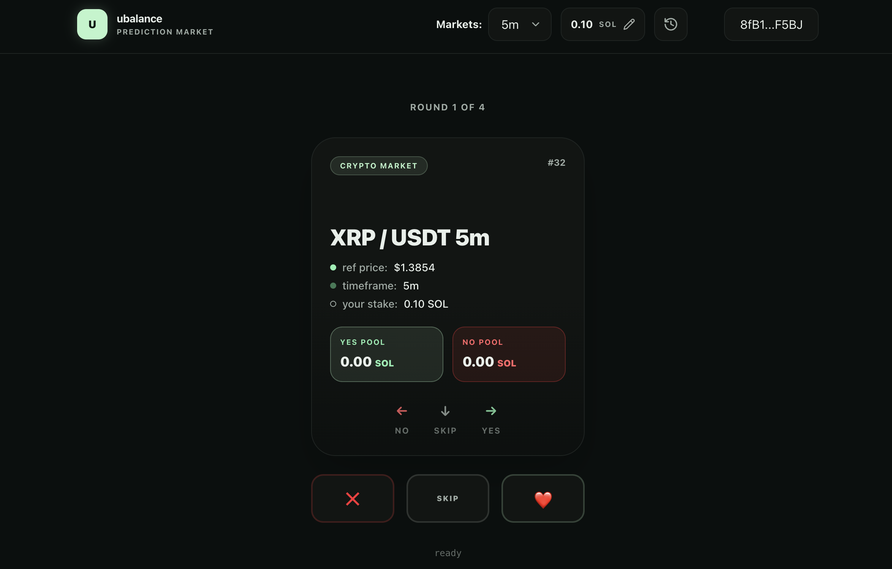

# ubalance prediction market



`Ubalance` is a swipe-based prediction market on Solana that uses MagicBlock Ephemeral Rollups (ER) for fast prediction writes and periodically settles round state back to base Solana.

Main characteristics:

- Swipe-first frontend for `yes / no / skip` decisions.
- Fastify backend that manages auth, market seeding, round lifecycle, and relay transaction preparation.
- Anchor program for market/round state transitions.
- MongoDB persistence for market metadata, round snapshots, and user action aggregates.
- Pyth Hermes price feeds for reference and settlement prices.

This repo is split into:

- `client/`: Next.js app + wallet adapter + relay submit UX.
- `server/`: API + lifecycle orchestrator + chain admin + oracle + Mongo.
- `contracts/anchor/`: on-chain program.

## How It Works

### 1) Startup and bootstrap

On server boot:

1. Seed markets into Mongo (`markets` collection).
2. Ensure each active market exists on-chain (initialize + activate if missing).
3. Ensure at least one `predicting` round exists per market.
4. Delegate round PDAs to MagicBlock ER when needed.

Bootstrap is triggered in background in `server/src/routes/index.ts`.

### 2) Round lifecycle

Round states are: `predicting -> locked -> resolved`.

Lifecycle loop in `server/src/features/rounds/rounds.service.ts`:

1. `ensure_predicting_rounds`: creates/recovers predicting rounds.
2. `lock_expired_rounds`: when `close_at_ms` passes:
   lock uses base RPC, but first tries ER `commit_and_undelegate` if the round is delegated.
3. `resolve_expired_rounds`: after `ROUND_RESOLVE_DELAY_SECONDS`, fetches oracle settlement price and resolves on-chain.
4. Round document is updated in Mongo with signatures and final winning side.

### 3) User prediction flow

User action path:

1. Wallet signs auth challenge (`/auth/challenge`, `/auth/verify`).
2. Client requests relay tx skeleton: `POST /rounds/:roundId/actions/relay-prepare`.
3. Server returns partially signed transaction (admin signs fee payer side).
4. User wallet signs and sends raw tx to ER RPC.
5. Client records action to backend: `POST /rounds/:roundId/actions`.
6. Backend updates per-round totals in Mongo.

### 4) Auth model

Auth is wallet-signature based and Mongo-backed:

- Challenge includes wallet + nonce + timestamp and is stored in `auth_challenges`.
- Session token is stored in `auth_sessions`.
- Both collections use TTL indexes on `expires_at`, so expiry is automatic.
- Sessions survive process restarts (while still within TTL).

## MagicBlock Usage

MagicBlock is used for round-account delegation and ER transaction execution.

Where this happens:

- Delegation program IDs and helpers: `@magicblock-labs/ephemeral-rollups-sdk`.
- Delegating round PDA: `chain_admin_service.delegate_round_account`.
- Submitting ER tx: `chain_admin_service.send_er_transaction`.
- Committing ER state back to base: `commit_and_undelegate_round`.
- Ownership sync check: waits until round account owner is back to program ID on base layer.

### Delegation lifecycle snippet

```ts
const delegated = await chain_admin.is_round_delegated({ market_index, round_number });
if (!delegated) {
  await chain_admin.delegate_round_account({ market_index, round_number });
}

await chain_admin.commit_and_undelegate_round({ market_index, round_number });
await chain_admin.lock_round({ market_index, round_number });
```

### ER connection surface

- Server exposes ER config at `GET /api/v1/er/connection`.
- Server exposes known validators at `GET /api/v1/er/validators`.
- Client wallet connection uses `NEXT_PUBLIC_ER_RPC_URL` and `NEXT_PUBLIC_ER_WS_URL`.

## On-Chain Program (Anchor)

Program source: `contracts/anchor/programs/swap-prediction-market/src/lib.rs`.

Core instructions:

- `initialize_market`
- `set_market_active`
- `open_round`
- `place_prediction`
- `lock_round`
- `resolve_round`
- `delegate_pda`
- `commit_round`
- `commit_and_undelegate_round`

Important behavior:

- `place_prediction` currently updates aggregate totals on `Round`.
- It does not transfer escrow funds in this version.
- Winning side is derived from settlement vs reference price.

## API Overview

Base path: `/api/v1`

Public routes:

- `GET /markets`
- `GET /markets/:slug`
- `GET /rounds/active`
- `GET /rounds/history?limit=20&marketSlug=...`
- `GET /rounds/:roundId`
- `GET /er/validators`
- `GET /er/connection`

Server health route (outside `/api/v1`):

- `GET /health`

Auth routes:

- `POST /auth/challenge`
- `POST /auth/verify`
- `GET /auth/me` (Bearer token)

Protected round action routes:

- `POST /rounds/:roundId/actions/relay-prepare` (Bearer token)
- `POST /rounds/:roundId/actions` (Bearer token)

## Snippets

### Wallet auth handshake (client-side)

```ts
const challenge = await auth_api.request_challenge(walletAddress);
const messageBytes = new TextEncoder().encode(challenge.data.message);
const signature = await wallet.signMessage(messageBytes);
const verification = await auth_api.verify_challenge(walletAddress, bs58.encode(signature));
const sessionToken = verification.data.token;
```

### Relay prepare -> user sign -> submit

```ts
const prepared = await rounds_api.prepare_relay_action(roundId, side, amountLamports, sessionToken);
const unsignedTx = Transaction.from(decodeBase64(prepared.data.transactionBase64));
const signedTx = await wallet.signTransaction(unsignedTx);
const txSignature = await connection.sendRawTransaction(signedTx.serialize());

await rounds_api.submit_action(roundId, side, amountLamports, sessionToken, txSignature);
```

### Fetch active rounds

```bash
curl http://localhost:3001/api/v1/rounds/active
```

## Project Structure

```text
.
├── client/
│   ├── src/app/                      # Next.js app router entry
│   ├── src/components/game/          # Swipe card + game flow
│   ├── src/components/wallet/        # Wallet adapter + modal integration
│   ├── src/lib/*.api.ts              # Backend API clients
│   └── src/types/                    # Shared client-side types
├── server/
│   ├── src/features/auth/            # Wallet challenge/session auth
│   ├── src/features/markets/         # Market seed + chain sync
│   ├── src/features/rounds/          # Round lifecycle + action recording
│   ├── src/features/chain/           # Solana + MagicBlock transaction logic
│   ├── src/features/oracle/          # Pyth Hermes integration
│   ├── src/features/er/              # ER config/validator endpoints
│   ├── src/shared/mongo.ts           # Mongo connection + indexes
│   └── scripts/smoke-er-lifecycle.mjs
└── contracts/anchor/
    └── programs/swap-prediction-market/src/lib.rs
```

## Setup

### Prerequisites

- Node.js 20+ and npm.
- MongoDB instance.
- Funded Solana devnet wallet for admin operations.
- Optional: Anchor toolchain if you plan to build/deploy the contract.

### 1) Install dependencies

```bash
npm run install:all
```

### 2) Configure environment files

```bash
cp server/.env.example server/.env
cp client/.env.example client/.env
```

Recommended server values (template):

```env
PORT=3001
HOST=0.0.0.0
CLIENT_ORIGIN=http://localhost:3000
ER_RPC_URL=https://devnet-us.magicblock.app
ER_WS_URL=wss://devnet-us.magicblock.app
PYTH_HERMES_URL=https://hermes.pyth.network
SOLANA_RPC_URL=https://api.devnet.solana.com
UBALANCE_PROGRAM_ID=FkZVTshsawSNHYzxFZFfdBJUbLxvQJVhWtJqi8FgunFG
UBALANCE_ADMIN_SECRET_KEY=REPLACE_WITH_YOUR_SECRET_KEY
ER_VALIDATOR_PUBKEY=MUS3hc9TCw4cGC12vHNoYcCGzJG1txjgQLZWVoeNHNd
MONGODB_URI=mongodb://127.0.0.1:27017
MONGODB_DB_NAME=ubalance_prediction_market
ROUND_RESOLVE_DELAY_SECONDS=20
AUTH_CHALLENGE_TTL_SECONDS=300
AUTH_SESSION_TTL_SECONDS=86400
```

Client template:

```env
NEXT_PUBLIC_API_URL=http://localhost:3001/api/v1
NEXT_PUBLIC_SOLANA_RPC_URL=https://api.devnet.solana.com
NEXT_PUBLIC_ER_RPC_URL=https://devnet-us.magicblock.app
NEXT_PUBLIC_ER_WS_URL=wss://devnet-us.magicblock.app
NEXT_PUBLIC_UBALANCE_PROGRAM_ID=FkZVTshsawSNHYzxFZFfdBJUbLxvQJVhWtJqi8FgunFG
```

### 3) Generate local key files (optional helper)

```bash
cd server
npm run generate-admin-keypair
npm run generate-smoke-keypair
```

These scripts create files under `server/.keys/` for local use.

Set `UBALANCE_ADMIN_SECRET_KEY` in `server/.env` using your own key material before running lifecycle operations.

### 4) Run app

From repo root:

```bash
npm run dev
```

URLs:

- Client: `http://localhost:3000`
- Server: `http://localhost:3001`
- Health: `http://localhost:3001/health`

## Smoke Lifecycle Test

Run one end-to-end ER lifecycle iteration:

```bash
cd server
npm run smoke:lifecycle -- --iterations 1
```

What it validates:

- Auth challenge + session flow.
- Active predicting round discovery.
- Prediction tx submission on ER.
- Backend action recording.
- Round transition to `locked` then `resolved`.

You can reuse a running server:

```bash
npm run smoke:lifecycle -- --reuse-server --iterations 2
```

## Security Notes

- Never commit real `.env` files or private keys.
- Keep `UBALANCE_ADMIN_SECRET_KEY` local only.
- Rotate keys immediately if they are ever exposed.
- `server/.keys/` is already ignored by git and should remain local.
